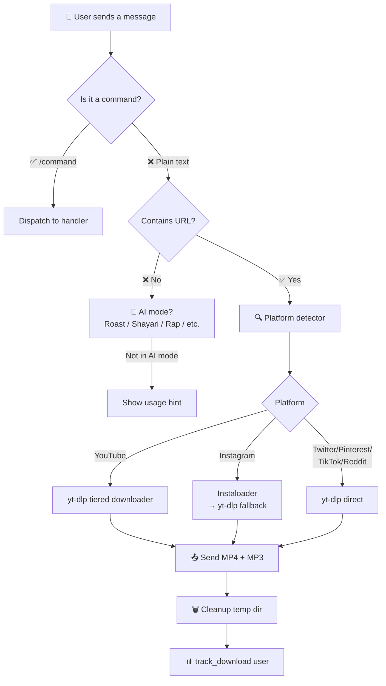
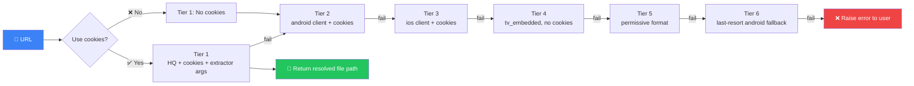
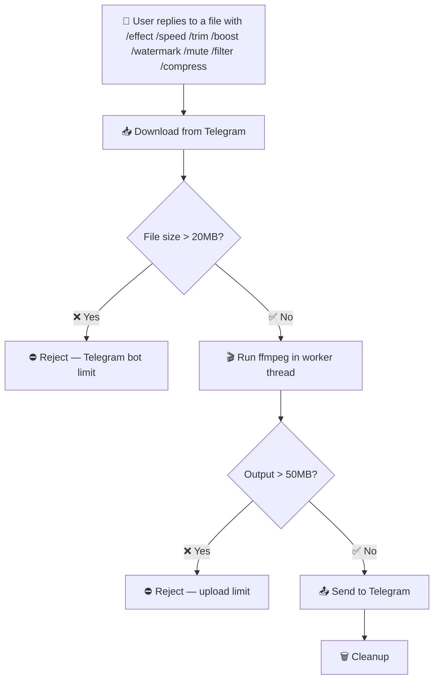
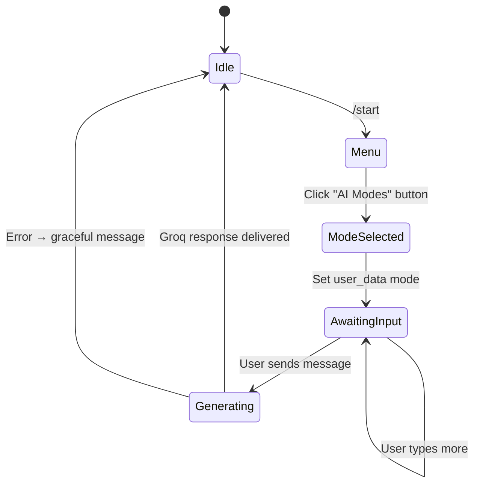
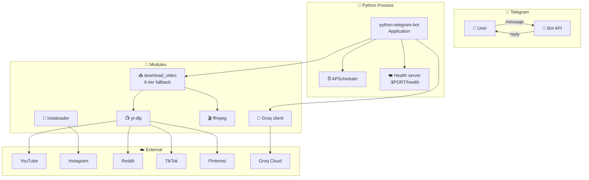
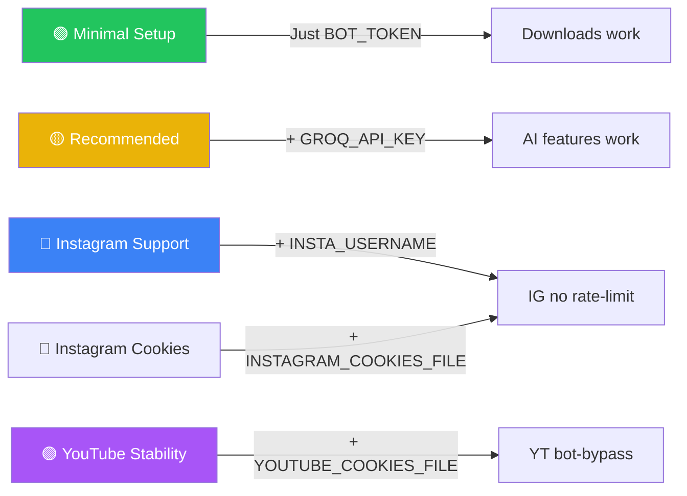
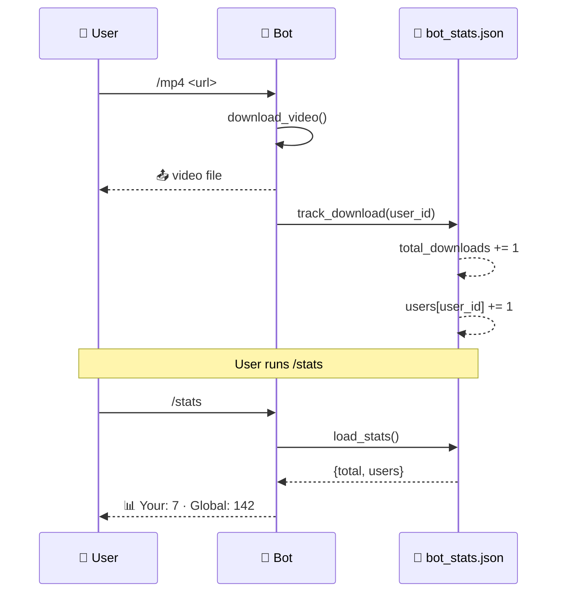

<div align="center">

# ⚡ Download World


### *The all-in-one Telegram media toolkit — 40+ commands, AI-powered, zero subscription.*

<br/>

[](https://python.org)
[](https://core.telegram.org/bots)
[](https://groq.com)
[](https://github.com/yt-dlp/yt-dlp)
[](LICENSE)
[](https://render.com)

<br/>

[**✨ Live Demo**](#-try-it-now) · [**📥 Install**](#-quick-start) · [**🚀 Deploy**](#-deploy) · [**📖 Docs**](#-command-reference) · [**🐛 Help**](#-troubleshooting)

<br/>

```
   ╔══════════════════════════════════════════════════════════╗
   ║   📥  Download     🎬  Edit     🤖  AI     📊  Analyze  ║
   ╚══════════════════════════════════════════════════════════╝
```

</div>

---

## 🎬 Demo & Screenshots

<div align="center">

### ✨ *The full command palette at a glance*

| 🌟 **Auto-Downloader** | 🎛️ **Media Studio** | 🤖 **AI Suite** |
|:---:|:---:|:---:|
| Just paste a link | Trim · Compress · Watermark | Roast · Shayari · Rap |
| MP4 + MP3 sent back-to-back | Mute · Speed · Reverse · Boost | OCR · Caption · TTS |
| YouTube, IG, TikTok, Twitter, FB | Sticker · GIF · Filter · Effect | Transcribe · Fortune · Recipe |

</div>

<br/>

<!-- GIF PLACEHOLDER 1: Replace the src with a screen recording of the bot in action -->
<div align="center">
  
  <p><em>↑ Replace this with a real screen-recording GIF of your bot in action</em></p>
</div>

<br/>

---

## 🧭 Interactive Workflows

> Click any node to read that section of the README. Each diagram shows the bot's *decision path* — what happens when a user sends a message.

### 📨 1. Message Routing — How a user message is handled



### 🎬 2. yt-dlp Tiered Download Pipeline



### 🛠️ 3. Media Studio (FFmpeg) — Reply-to-message tools



### 🤖 4. AI Mode Flow



---

## ✨ Feature Matrix

<div align="center">

### 📥 1. Downloaders & Extractors

| Command | Platform | What it does | GIF |
|:---|:---|:---|:---|
| `/mp4 <url>` | Universal | Download best MP4 (auto-compress) | [▶️](https://media.giphy.com/media/3o7TKsQ8gqVrXyQd3e/giphy.gif) |
| `/mp3 <url>` | Universal | Extract 192kbps MP3 via FFmpeg | [▶️](https://media.giphy.com/media/3oEjI6SIIHBdRxXI40/giphy.gif) |
| `/thumb <url>` | YouTube | Hi-res thumbnail (max resolution) | [▶️](https://media.giphy.com/media/3o6Mb6jpAdhqypB97y/giphy.gif) |
| `/subs <url> [lang]` | YouTube | Manual + auto-generated SRT/VTT | [▶️](https://media.giphy.com/media/3o7TKsQ8gqVrXyQd3e/giphy.gif) |
| `/gif <url\|reply>` | Any | 8s animated GIF with palettegen | [▶️](https://media.giphy.com/media/3oEjI6SIIHBdRxXI40/giphy.gif) |
| `/playlist <url>` | YouTube | Up to 25 items, MP3 or MP4 | [▶️](https://media.giphy.com/media/QYhTOmFoH1BThxmTvy/giphy.gif) |
| `/ttslideshow <url>` | TikTok | Every slide of a photo post | [▶️](https://media.giphy.com/media/3o6Mb6jpAdhqypB97y/giphy.gif) |
| `/pinboard <url>` | Pinterest | All images from a public board | [▶️](https://media.giphy.com/media/3o7TKsQ8gqVrXyQd3e/giphy.gif) |
| `/reddit <sub\|url>` | Reddit | Top image/video from a subreddit | [▶️](https://media.giphy.com/media/3oEjI6SIIHBdRxXI40/giphy.gif) |
| `/iginfo <user\|url>` | Instagram | Bio, contact, business details | [▶️](https://media.giphy.com/media/3o6Mb6jpAdhqypB97y/giphy.gif) |
| `/search <query>` | YouTube | One-click download buttons | [▶️](https://media.giphy.com/media/QYhTOmFoH1BThxmTvy/giphy.gif) |
| `/ycomments <url>` | YouTube | Top 10 comments with likes | [▶️](https://media.giphy.com/media/3o7TKsQ8gqVrXyQd3e/giphy.gif) |
| `/hashtags <url\|list>` | Instagram | Score reach 0-10 of a hashtag set | [▶️](https://media.giphy.com/media/3oEjI6SIIHBdRxXI40/giphy.gif) |

</div>

<div align="center">

### 🎛️ 2. Media Studio (FFmpeg-powered)

</div>

```
┌──────────────────────────────────────────────────────────────┐
│  🔊  /effect <type>     chipmunk | deep | echo | robot |     │
│                        bassboost | nightcore                │
│  ⚡  /speed <0.5-2.0>   Change tempo (video keeps pitch too) │
│  🔄  /reverse           Play any media backward              │
│  🔊  /boost <dB>        +1 to +30 dB volume gain             │
│  ✂️  /trim <start> <end>  HH:MM:SS or seconds               │
│  📉  /compress <mode>   low (480p) | medium (720p) | high    │
│  🏷️  /watermark <text>  Burn text on photo or video          │
│  🔇  /mute              Strip audio track from video         │
│  🎨  /filter <type>     gray | blur | edge (sketch)          │
│  🎙️  /voice             Convert to native Telegram voice     │
│  🎞️  /sticker           Image or short video → WebP sticker  │
└──────────────────────────────────────────────────────────────┘
```

<div align="center">

### 🤖 3. AI Suite (Groq-Powered, Free)

| Command | What it does | Engine |
|:---|:---|:---|
| `/caption` | AI Instagram-style caption from a photo | `llama-3.2-11b-vision` |
| `/ocr` | Extract text from image (eng+hin) | Tesseract → Groq Vision fallback |
| `/tts <text>` | Natural voice via PlayAI | `playai-tts` |
| `/transcribe` | Whisper speech-to-text | `whisper-large-v3` |
| `🔥 Roast` | 4-line savage Hinglish roasts | `llama-3.1-8b-instant` |
| `✍️ Shayari` | Ghalib-style Hinglish poetry | `llama-3.1-8b-instant` |
| `🎤 Rap` | 8-line desi hip-hop bars | `llama-3.1-8b-instant` |
| `🔮 Fortune` | Funny horoscope reading | `llama-3.1-8b-instant` |
| `📝 Story` | 10-line desi story | `llama-3.1-8b-instant` |
| `🍕 Recipe` | Bhai-style cooking tips | `llama-3.1-8b-instant` |

</div>

<div align="center">

### 🛠️ 4. Utilities & Productivity

</div>

```
┌──────────────────────────────────────────────────────────────┐
│  🌐  /tr <text>          Google Translate (auto → Hindi)    │
│  📞  /extract            Emails / phones / handles / URLs   │
│  🔗  /short <url>        CleanURI → is.gd fallback chain    │
│  🔮  /qr <text>          High-res QR via api.qrserver.com    │
│  ⏰  /remind 10m <task>  APScheduler one-shot timer          │
│  📝  /notes              Personal encrypted-ish note store   │
│  📊  /stats              Personal + global download counter  │
└──────────────────────────────────────────────────────────────┘
```

---

## 🚀 Quick Start

### 1️⃣ Prerequisites

```
✅  Python 3.11+
✅  FFmpeg (in PATH) — required for /effect /speed /trim /watermark /mute /compress /voice
✅  A Telegram bot token from @BotFather
✅  (Optional) Groq API key from console.groq.com — for AI features
```

### 2️⃣ Clone & Install

```bash
git clone https://github.com/yourusername/Download-World.git
cd Download-World

python -m venv venv
source venv/bin/activate    # Windows: venv\Scripts\activate

pip install -r requirements.txt
```

### 3️⃣ Configure `.env`

```bash
cp .env.example .env
# then edit .env:
```

```env
# Required
BOT_TOKEN=1234567890:ABCdefGHIjklMNOpqrsTUVwxyz

# Optional but recommended
GROQ_API_KEY=gsk_...

# Optional Instagram support (otherwise the bot works but IG will be rate-limited)
INSTA_USERNAME=your_instagram_handle
INSTAGRAM_COOKIES_FILE=instagram_cookies.txt

# Optional YouTube bot-detection bypass
YOUTUBE_COOKIES_FILE=youtube_cookies.txt
YOUTUBE_EXTRACTOR_ARGS="youtube:player_skip=webpage,configs"
```

### 4️⃣ Run

```bash
python bot.py
```

You should see:

```
✅ Instaloader: logged in via cookies (12 cookies loaded)
✅ FFmpeg found at: /opt/homebrew/bin/ffmpeg
✅ Bot ready — scheduler started, instaloader configured.
🤖 Bot is starting up... waiting for messages.
```

---

## 🚀 Deploy

<div align="center">

| Platform | Cost | Sleep behavior | Health check |
|:---|:---:|:---|:---:|
| **[Render](https://render.com)** | Free tier | 15min idle | ✅ Built-in |
| **[Railway](https://railway.app)** | $5/mo | None | ✅ Built-in |
| **[Fly.io](https://fly.io)** | Free allowance | None | ✅ Built-in |
| VPS (DigitalOcean, Hetzner) | $4-6/mo | None | DIY |

</div>

### ⚡ One-Click Render Deploy

1. Push this repo to GitHub
2. Open [dashboard.render.com](https://dashboard.render.com) → **New +** → **Blueprint**
3. Connect your repo — Render reads `render.yaml` automatically
4. Add `BOT_TOKEN` and `GROQ_API_KEY` in the **Environment** tab
5. Click **Apply** — done in 2 minutes ✅

> The included `Dockerfile` runs `python bot.py` and serves a `/health` endpoint on `$PORT` so Render's watchdog stays happy.

### 🐳 Docker (any VPS)

```bash
docker build -t download-world .
docker run -d \
  --name download-world \
  --env-file .env \
  --restart unless-stopped \
  download-world
```

---

## 📖 Command Reference

<details>
<summary><b>📥 Downloaders — 13 commands</b></summary>

```
/mp4 <url>               Best video (auto-compressed if large)
/mp3 <url>               Best audio as 192kbps MP3
/thumb <url>             Highest-resolution thumbnail
/subs <url> [lang]       Subtitles (SRT/VTT), default English
/gif <url|reply> [secs]  Animated GIF, default 8s
/search <query>          YouTube search with one-click buttons
/playlist <url> [mp3|mp4]  Up to 25 items, sequential download
/iginfo <user|url>       Instagram bio + business + contact
/ycomments <url>         Top 10 comments with like count
/hashtags <url|list>     Score a reel's hashtag reach
/reddit <sub|url>        Top image/video from a subreddit
/ttslideshow <url>       Every image of a TikTok photo post
/pinboard <url> [count]  All images from a Pinterest board
```

</details>

<details>
<summary><b>🎛️ Media Studio — 11 Commands (FFmpeg)</b></summary>

```
/effect <type>    chipmunk | deep | echo | robot | bassboost | nightcore
/speed <0.5-2.0>  Audio tempo, video keeps pitch via atempo
/reverse          Reverse any media
/boost <dB>       +1 to +30 dB volume gain
/trim <s> <e>     HH:MM:SS or seconds
/compress <mode>  low | medium | high
/watermark <text> Burn text overlay
/mute             Strip audio
/filter <type>    gray | blur | edge
/voice            → native Telegram voice note
/sticker          → WebP sticker (image or ≤3s video)
```

</details>

<details>
<summary><b>🤖 AI — 10 modes</b></summary>

```
/caption          Photo → AI Instagram caption
/ocr              Photo → extracted text (eng+hin)
/tts <text>       Text → natural voice (PlayAI)
/transcribe       Audio/voice → Whisper transcription
🔥 Roast          /start → AI Modes → Roast
✍️ Shayari        /start → AI Modes → Shayari
🎤 Rap            /start → AI Modes → Rap
🔮 Fortune        /start → AI Modes → Fortune
📝 Story          /start → AI Modes → Story
🍕 Recipe         /start → AI Modes → Recipe
```

</details>

<details>
<summary><b>🛠️ Utilities — 7 commands</b></summary>

```
/tr <text>        Auto → Hindi translation
/extract          Scrape emails/phones/handles/URLs from text
/short <url>      URL shortener (CleanURI → is.gd)
/qr <text>        Generate 400×400 QR code
/remind 10m <msg> One-shot reminder
/notes [text]     Personal note store
/stats            Your downloads + global total
```

</details>

---

## 🏗️ Architecture



### 📂 Project Structure

```
Download-World/
├── 🤖 bot.py                       # 3800+ lines, 37 commands
├── 📦 requirements.txt             # Pinned dependencies
├── 🐳 Dockerfile                   # Production container
├── 🚂 render.yaml                  # Render Blueprint
├── 🔐 .env.example                 # Config template
├── 🚫 .gitignore
├── 🍪 instagram_cookies.txt        # Optional — Netscape format
├── 🍪 youtube_cookies.txt          # Optional — bypasses YT bot check
├── 📄 Procfile                     # Heroku/Railway
├── 🐍 runtime.txt                  # Python 3.11
├── ⚙️ nixpacks.toml                # Nixpacks build hint
├── 🩺 DEPLOYMENT-TROUBLESHOOTING.md
├── 🛠️ SETUP_GUIDE.md
└── 🖼️ logo.jpg
```

---

## 🛠️ Tech Stack

<div align="center">

| Layer | Library | Why |
|:---|:---|:---|
| 🤖 Bot | **python-telegram-bot 21.5** | Stable v20+ API, async-native |
| 📺 Video | **yt-dlp ≥ 2025.10** | Beats YouTube's bot detection |
| 📸 IG | **instaloader 4.15** | Login + cookies support |
| 🧠 AI | **groq 1.2** | Free, fast Llama 3.1 + Whisper + PlayAI |
| 🎬 Media | **FFmpeg 8.x** | All effects, filters, encoding |
| ⏰ Jobs | **APScheduler 3.10** | Async-aware scheduling for /remind |
| 🌐 HTTP | **httpx 0.28** | Used for QR/short APIs |
| 🌍 I18N | **deep-translator 1.11** | Google Translate, no key needed |
| 🔐 Config | **python-dotenv 1.0** | .env loading |
| 🏥 Health | **http.server** (stdlib) | Render $PORT health check |

</div>

---

## 🔧 Configuration Reference



| Variable | Required | Effect when missing |
|:---|:---:|:---|
| `BOT_TOKEN` | ✅ | Bot won't start |
| `GROQ_API_KEY` | ❌ | AI commands show "missing key" error |
| `INSTA_USERNAME` | ❌ | Instagram uses anonymous session, hits 401 |
| `INSTA_PASSWORD` | ❌ | Skips password login |
| `INSTAGRAM_COOKIES_FILE` | ❌ | Skips cookie auth |
| `YOUTUBE_COOKIES_FILE` | ❌ | YouTube downloads may hit "Sign in to confirm" |
| `YOUTUBE_EXTRACTOR_ARGS` | ❌ | Default extractor behavior |

---

## 📊 Stats Flow



---

## 🐛 Troubleshooting

<details>
<summary><b>❌ "ffmpeg not found"</b></summary>

```bash
# macOS
brew install ffmpeg

# Ubuntu / Debian
sudo apt update && sudo apt install -y ffmpeg

# Alpine (Docker)
apk add --no-cache ffmpeg
```

The bot **prints** the path on startup if found, so check your deployment logs.

</details>

<details>
<summary><b>❌ "Sign in to confirm you're not a bot" (YouTube)</b></summary>

1. Open YouTube in a logged-in browser
2. Install a browser extension like *Get cookies.txt LOCALLY*
3. Export cookies for `youtube.com` as Netscape format
4. Save as `youtube_cookies.txt` next to `bot.py` (already in `.gitignore`)

</details>

<details>
<summary><b>❌ Instagram 401 / Login Required</b></summary>

1. Log into Instagram in a browser
2. Export cookies for `instagram.com`
3. Save as `instagram_cookies.txt`
4. Or set `INSTA_USERNAME` + `INSTA_PASSWORD` (will trigger checkpoint sometimes)

</details>

<details>
<summary><b>❌ TTS says "speech generate nahi ho paya"</b></summary>

- Verify `GROQ_API_KEY` is valid at [console.groq.com](https://console.groq.com)
- Check free-tier rate limits (very generous, but real)
- Try shorter text (<1000 chars)

</details>

<details>
<summary><b>❌ "File > 50MB" error</b></summary>

Telegram bots cannot upload files larger than 50 MB to a chat. The bot automatically:
- Skips playlist items >50MB
- Compresses MP4 with libx264 CRF 28 on `/mp4`
- Refuses audio >500MB

For larger files, deploy with a [local Bot API server](https://github.com/tdlib/telegram-bot-api).

</details>

<details>
<summary><b>❌ Render deployment crashes</b></summary>

1. Check the `Dockerfile` and `render.yaml` are committed
2. Verify the health endpoint responds: `curl https://your-app.onrender.com/`
3. Look at logs in Render dashboard → Logs tab
4. See [DEPLOYMENT-TROUBLESHOOTING.md](DEPLOYMENT-TROUBLESHOOTING.md) for the full guide

</details>

---

## 🗺️ Roadmap

```mermaid
roadmap
    title Download World Roadmap
    section ✅ Shipped
        Core downloader (40+ sites) : done
        AI suite (Roast, TTS, OCR)  : done
        Media studio (FFmpeg)       : done
        Social-media extras         : done
        Health check + Docker       : done
    section 🔜 Next
        Web dashboard for stats     : planned
        Multi-language UI           : planned
        User accounts + quotas      : planned
        Spotify / SoundCloud        : planned
    section 💭 Ideas
        Voice cloning via XTTS      : research
        Auto-clip viral moments     : research
```

---

## 🤝 Contributing

PRs welcome! The codebase is intentionally a **single-file** bot (`bot.py`) so you can fork, modify, and ship your own variant in minutes. Conventions:

- New command? Add `async def X_command(...)` near related handlers, then register it in `main()` with `app.add_handler(CommandHandler("X", X_command))` and in the `commands` list inside `post_init`.
- New helper? Put it next to other helpers at the top of the file.
- Reuse `_resolve_downloaded_path`, `download_video`, `_ensure_netscape_cookies` — they already do the heavy lifting.

---

## 📜 License & Credits

```
MIT License — free to use, modify, ship.

Built with ❤️ in India 🇮🇳 by Soumya Chakraborty.
Powered by the open-source community:
  python-telegram-bot · yt-dlp · instaloader · groq · ffmpeg
```

---

<div align="center">

**If this project saved you a subscription, drop a ⭐ — it helps a lot.**

<br/>

`★ Star this repo` · `🍴 Fork it` · `📢 Share with friends`

<br/>

<sub>Last updated · Build `v3.0` · 37 commands · 5 AI modes · 11 media tools</sub>

</div>
